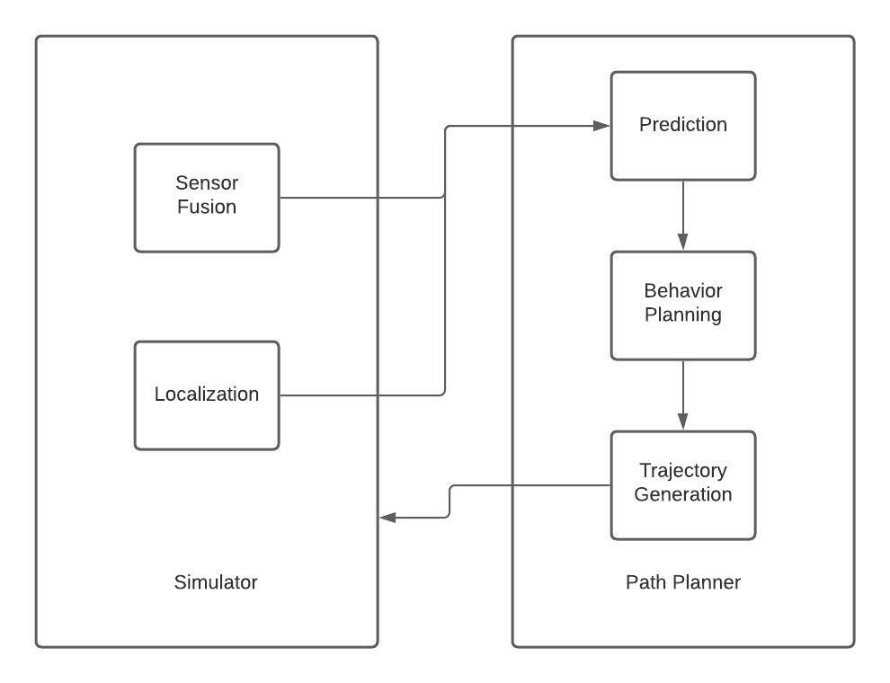
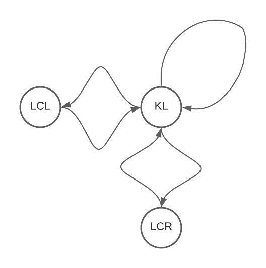
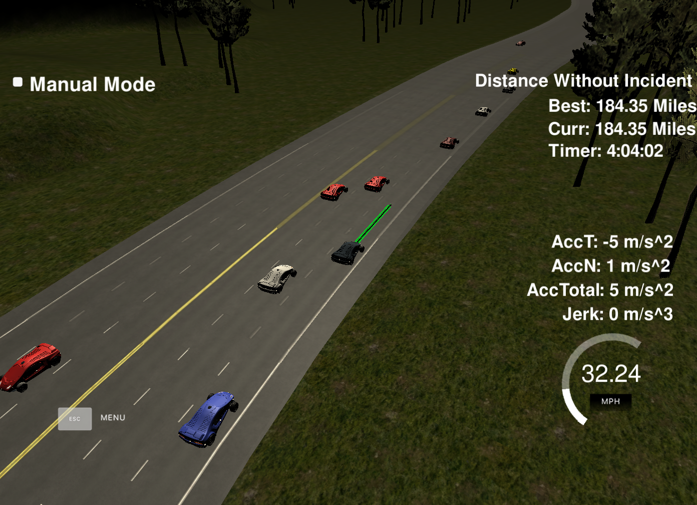

# Highway Driving Project

## Introduction

The goal of this project is to safely navigate around a virtual highway with other traffic that is driving +-10 MPH of the 50 MPH speed limit.

## Content Outline
- Project Environment
- Overall Structure
- Planner Features
- Implementation Details
- Test Result
- Conclusion
- How to Use

## Project Environment
### 1. The Highway Map
The [map](./data/hgihway_map.csv) is represented as a list of waypoints that go all the way around the track. The track contains 181 waypoints. Each waypoint is represented as {x, y, s, dx, dy} where (x,y) is the position in global map coordinate system, s in Frenet coordinate system, and {dx, dy} is the Frenet d unit normal vector split up into x and y component.
### 2. The Unity Simulator
The [Unity simulator](https://github.com/udacity/self-driving-car-sim/releases/tag/T3_v1.2) expects a list of waypoints from the planning module as input and moves the ego car to a new waypoint every 20ms. It outputs real-time localization and sensor fusion data as well as information about the previous path.
### 3. Web Communication
[uWebSockets](https://github.com/uWebSockets/uWebSockets) is used as a tool to communicate between the path planning module and the simulator.
### 4. Localization
Then simulator sends localization data to the path planning module. The data format is : [x, y, s, d, yaw, speed]. The (x, y) is the ego location in the global map coordinate system. (s, d) is the ego location in Frenet coordinate system. The yaw is in the global map coordinate system. The speed is in m/s.
### 5. Sensor Fusion
The simulator sends sensor fusion data to the path planning module. It contains information about the cars around the ego car. The data format for each car is : [id, x, y, vx, vy, s, d]. The id is a unique identifier for the car. The x, y values are in global map coordinate system, and the vx, vy values are the velocity components, also in global map coordinate system. The s and d are the Frenet coordinates for the car.

## Overall Structure


## Planner Features
### Dynamic Following Distance
The following distance depends on the ego car's speed. The faster the speed, the larger the following distance. 
### Collision Avoidance
When the car ahead is too close, slow down and maintain a safe following distance.


### Detecting Merging Vehicles
The planner is able to predict a car is merging to our lane and react to it.


### Detecting Fast Vehicles Behind
The planner is able to detect fast car behind on the side lanes. The ego car will not change lane when there is a fast car behind on the target lane.


### Tracking the Slowest Vehicle Ahead
The planner tracks the slowest vehicle ahead instead of only the closest vehicle ahead, and adjust the ego speed accordingly. If there are two cars ahead and the first car is slower, the ego car would slow down before the second car starts to slow down.
### Behavior Type and Speed Control are Independent
The behavior planner determines the behavior type and the target speed independently. The ego car can adjust speed while changing lanes. For example, when the ego car is following a slow car and there is an opportunity to change lane, the ego car will speed up while changing lanes. This is what human drivers do. It is dangerous to change lanes at a low speed.


### Mid Lane Preference
When the current lane and the mid lane both have a slow car ahead. The planner would decide to change to the mid lane if it is safe to do so. The mid lane is favored because it offers more lane changing options.


### Preventing Unnecessary Lane Changes
Sometimes even though it is possible to change lane, doing so does not benefit the ego car. For example, the vehicle is following a slow vehicle, and there is a gap on the side for a lane change. However, there is a slow vehicle ahead on that lane. In this case, a lane change is not beneficial unless the destination lane is the mid lane.
The planner check if there is a slow car ahead on destination lane when deciding whether or not to change lane. If there is, the ego car will not change lane unless the destination lane is the mid lane.

### More Stable Speed
The ego car is able to maintain a more stable speed when not accelerating, usually +/- 0.1 MPH of the target speed.


### Using fewer Points from the Previous Path
For path smoothness, the planner only keeps 5 points from the previous path. Using fewer points allows the ego car to react to changing environment more quickly.

## Implementation Details
The code implementation follows the object-oriented programming style. 

In the main function, a [planner](./src/planner.h) object is instantiated and the LoadMap() function is called. Then when a message is recieved from the simulator, the ComputeNextPath() function is called to compute the next path. 
The ComputeNextPath() function first calls the PlanBehavior() function to compute the optimal behavior type and the target speed. Then the ComputeNextPath() function calls the GenerateTrajectory() function to compute a trajectory using the [spline](./src/spline.h) library.

### Behavior Planning Details



KL: Keep Lane

LCL: Lane Change Left

LCR: Lane Change Right

Pseudo Code for Behavior Planning Policy:
```
if there is no slow car ahead:
  if there is a vehicle merging to ego lane and can change lane:
    LCL or LCR to avoid
  else:
    KL
else if the car ahead is too close:
  KL
  target speed = 0
else if can change lane and no slow car ahead on the target lane:
  LCL or LCR
else:
  if ego is not in the mid lane and can change lane:
    LCL or LCR to the mid lane
  else:
    KL
    target speed = speed of the slowest car ahead
```


## Test Result
After fine-tuning various parameters, I am pretty happy with the test result.



4 hours of driving without incident.

[Youtube Video](https://youtu.be/dWayAiCB1Ow)

There are still some rare incidents where the ego car is not at fault. So I decided not to address them.

For example, the car in front of us suddenly slowed down, resulted in the car behind rear-ended us.


A car suddenly did a horrible lane change and there is nothing we could do to prevent a collision.


## Conclusion
Driving 4 hours without incident while averaging a 46 MPH speed is impressive. Overall, I am satisfied with the planner's performance. 

One area I want to improve is the speed control. Currently, the ego car adjust its speed with a constant acceleration. This results in a high jerk when switching from a constant speed to accelerating. For better comfort, the ego car should adjust its speed with a constant jerk. Even though the localization data does not include ego jerk, I can compute ego jerk using the previous path. I just need to figure out the math.

## How to Use
1. Download the [simulator](https://github.com/udacity/self-driving-car-sim/releases/tag/T3_v1.2)
2. Clone this repository.
3. Run either install-mac.sh or install-ubuntu.sh to install dependacies.
4. Build the project with CMake.
5. Run the executable with "./path_planning"
6. Run the simulator. To run the simulator on Mac/Linux, first make the binary file executable with the following command: 
```shell
sudo chmod u+x {simulator_file_name}
```